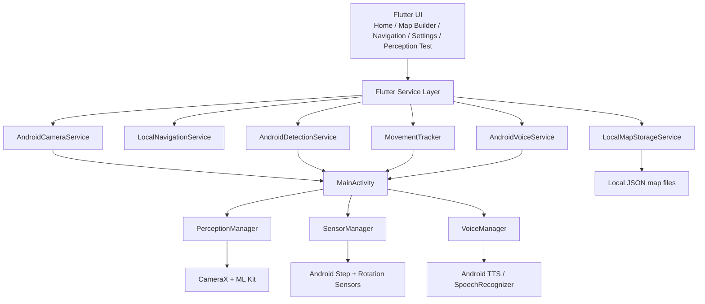

# NavAssist 2.0

> Assistive indoor awareness and navigation prototype for visually impaired users.


## Overview

NavAssist 2.0 is a Flutter-based Android prototype for environmental awareness and basic indoor guidance. The project explores a mobile-first assistive workflow using live camera input, Android sensors, local map creation, and spoken instructions.

This is a research and portfolio prototype. It demonstrates how an app can combine perception, route metadata, and accessibility-focused UI to help a user understand nearby obstacles and movement context in an indoor environment.

## Problem Statement

Visually impaired users often need real-time awareness of walls, obstacles, turns, and route progress in unfamiliar spaces. Even simple indoor movement can become uncertain without reliable environmental feedback. NavAssist addresses this by exploring a lightweight system that uses common mobile hardware and local processing to provide situational awareness.

## Proposed Solution

The current implementation uses:

- CameraX for camera preview and image analysis
- Google ML Kit object detection for obstacle awareness
- Android sensor APIs for step and heading tracking
- local JSON map storage for indoor route definition
- text-to-speech guidance for spoken instructions

This is not a production-ready autonomous navigation system. It is a functional prototype for experimentation, demonstration, and evaluation.

## Demo Flow

A simple live demonstration sequence is:

Home
→ Perception Test
→ demonstrate ML Kit detection
→ Map Builder
→ Saved Maps
→ Navigation
→ Settings

This sequence highlights the app’s core workflow: perception, mapping, route guidance, and tuning.

## What Makes NavAssist Different

- Voice-first accessibility: instructions are spoken through Android text-to-speech
- Computer vision: object detection is integrated through ML Kit
- Assistive environmental awareness: the app surfaces nearby obstacles and wall-like conditions
- Offline/local-first design: maps are saved and loaded locally without a backend
- Accessibility-focused UI: dark high-contrast interface with large touch targets and legible text

## Key Features

- High-contrast dark UI with large action buttons
- Home navigation flow for key app modules
- Map Builder for creating indoor route points
- Saved Maps screen for loading and deleting local maps
- Navigation screen for route progress and instruction playback
- Perception Test screen for live camera + detection feedback
- Android sensor-driven movement estimates
- Voice guidance via native Android TTS
- local settings for threshold tuning

## System Architecture



## Technology Stack

| Technology | Purpose |
|---|---|
| Flutter | UI and app flow |
| Dart | Application logic |
| Android | Primary target platform |
| Kotlin | Native Android bridge and services |
| CameraX | Camera preview and image analysis |
| Google ML Kit | Object detection |
| Android Sensors | Step detection and rotation-based heading |
| TextToSpeech / SpeechRecognizer | Voice output and recognition hooks |
| SharedPreferences | Persistent settings |
| path_provider | Local document storage |
| JSON files | Indoor map persistence |

## Screenshots

No actual screenshot assets are currently committed in this repository.

The expected files are:

- `assets/screenshots/home.png`
- `assets/screenshots/perception.png`
- `assets/screenshots/map_builder.png`
- `assets/screenshots/navigation.png`
- `assets/screenshots/settings.png`

Add these manually from a real device or emulator before publishing. Do not generate fake screenshots.

## Current Status

Status summary:

- WORKING: app shell, local map persistence, camera preview, ML Kit object detection, voice output, settings, and saved map management
- PROTOTYPE: route-following workflow, step-based movement estimation, map builder, and local navigation logic
- LIMITATION: indoor localization is approximate and not reliable for real-world navigation
- FUTURE SCOPE: robust localization, depth sensing, dynamic obstacle avoidance, and usability validation

## Limitations

The project is intentionally honest about its boundaries:

- step counts and heading estimates are approximate
- map creation depends on manually recorded route points
- wall detection is heuristic, not a certified safety system
- obstacle distance is not calibrated with true depth sensing
- navigation is prototype-level and should not be treated as a primary safety aid
- no robust autonomous indoor localization is currently implemented

## Future Scope

Realistic next steps include:

- visual-inertial odometry and drift reduction
- better indoor localization and waypoint correction
- depth sensing and more reliable obstacle distance estimation
- graph-based indoor routing and dynamic re-planning
- stronger voice guidance and accessible interaction patterns
- field testing with real users in real indoor environments

## Project Structure

```text
navassist_2/
├── android/                # Native Android integration and permissions
├── docs/                   # Architecture, status, and presentation docs
├── assets/screenshots/      # Screenshot placeholders and reference guide
├── lib/                    # Flutter app code
├── test/                   # Flutter tests
├── README.md               # Portfolio-facing project overview
├── analysis_options.yaml   # Dart analysis config
├── pubspec.yaml            # Flutter dependencies
├── pubspec.lock            # Locked dependency versions
├── .gitignore
└── navassist_2.iml
```

## Installation

Requirements:

- Flutter SDK
- Android Studio
- Android SDK configured for Flutter

Run:

```bash
flutter pub get
flutter run
```

The app requests camera, microphone, and activity recognition permissions at runtime for perception and movement features.

## Disclaimer

NavAssist 2.0 is a research and prototype assistive technology project. It is intended for exploration, academic evaluation, and portfolio demonstration. It should not be relied on as a primary safety or navigation system in real-world environments.

## Author

Pranav Powell
