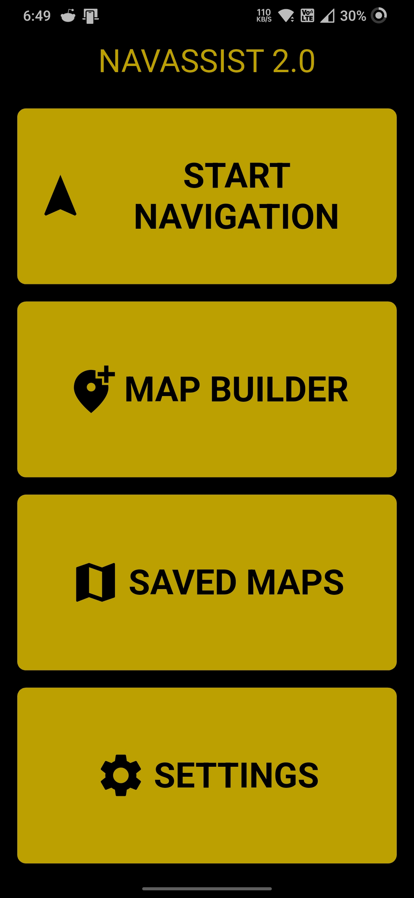
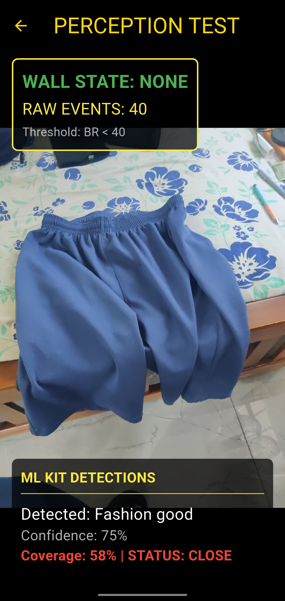
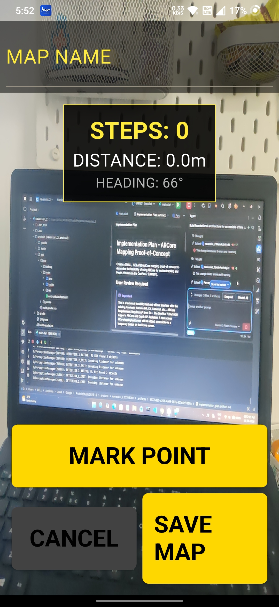
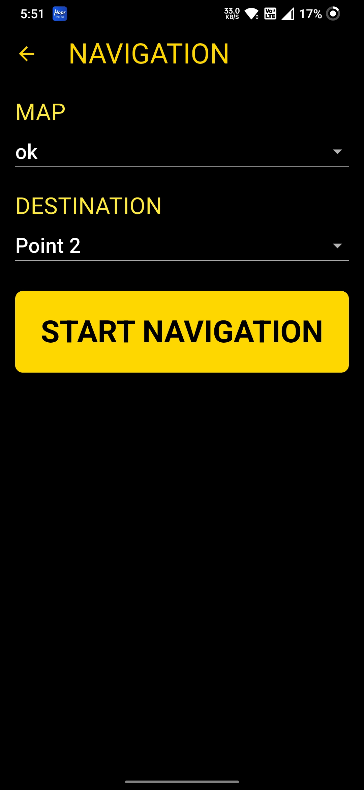
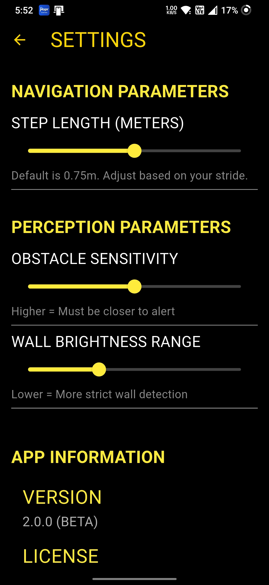

# NAVASSIST 2.0

A compact, voice-first indoor awareness prototype for visually impaired users.

[](#current-status)
[]
[]
[]

---

Hero

- WHAT IT IS — An Android-first Flutter prototype that combines live camera perception, simple local mapping, sensor-driven motion estimates, and spoken guidance.
- WHY IT MATTERS — Helps explore how low-cost mobile devices can provide contextual environmental awareness to increase independence for users with visual impairments.
- WHAT IT DEMONSTRATES — Native camera integration, ML-based object detection, step/heading-based route recording, and voice-first navigation instructions.

---

## 1 — Project overview

NavAssist 2.0 is a research-grade prototype that focuses on indoor environmental awareness and guided movement assistance. It provides:

- a perception test harness (camera preview + ML Kit detections),
- a Map Builder to record named waypoints while walking,
- a Navigation screen that follows recorded segments and provides spoken instructions.

The implementation is Android-first and accessibility-focused; it is intended for experimentation and demonstration, not as a replacement for certified assistive devices.

## 2 — The problem

Indoor navigation is hard for visually impaired users because:

- landmarks and obstacles can be hard to detect without sight
- accurate indoor localization (GPS-free) is challenging
- reliable, low-cost sensing and robust voice feedback are needed

NavAssist aims to explore practical techniques using smartphone cameras and sensors to improve situational awareness for short, repeatable indoor routes.

## 3 — The solution (what's actually implemented)

Camera → Native Android pipeline → ML Kit object detection → Flutter UI

Local map → MapBuilder (named points) → JSON persistence → Navigation prototype

Accessibility: user ↔ high-contrast UI ↔ voice feedback

Key notes:
- Camera preview and image analysis run in native Android (`PerceptionManager.kt`) using CameraX.
- Google ML Kit Object Detection runs in STREAM_MODE with multiple-object classification (as configured in the repo).
- Perception events (objects, brightness-based wall-state) are streamed to Flutter via EventChannel.
- Movement is estimated from Android sensors (step detector + rotation vector) and used to mark segments in the Map Builder.
- Navigation is a segment-following prototype that uses recorded steps/turns and speaks instructions via Android TTS.

## 4 — Key features

| Feature | What it does | Status |
|---|---|---:|
| Camera perception | Live camera preview from native Android | WORKING |
| ML Kit object detection | Object labels, bounding boxes, confidence (STREAM_MODE) | WORKING |
| Wall/environment detection | Brightness-based left/center/right heuristic | PROTOTYPE |
| Voice output | Android TextToSpeech for instructions and alerts | WORKING |
| Local map persistence | Save/load maps as JSON files in app storage | WORKING |
| Saved maps UI | List, view metadata, delete saved maps | WORKING |
| Map Builder | Record named points with step/distance metadata | PROTOTYPE |
| Navigation engine | Follow recorded segments and announce steps | PROTOTYPE |
| Sensor movement estimation | Step detector + rotation-vector heading | PROTOTYPE |
| Settings & tuning | SharedPreferences-backed thresholds for sensors/perception | WORKING |
| ARCore artifacts | Proof-of-concept files flagged as abandoned | EXPERIMENTAL / ABANDONED |

## 5 — App showcase

Gallery (real app screenshots included in the repository):

| Home | Perception |
|---:|:---|
|  |  |

| Map Builder | Navigation |
|---:|:---|
|  |  |

Settings



> All five screenshots are committed to `assets/screenshots/` and displayed above.

## 6 — Perception system (technical)

- Native camera integration: CameraX preview is created and exposed to Flutter via a SurfaceTexture.
- ML Kit Object Detector: configured in STREAM_MODE with multiple-object detection and classification enabled (see `PerceptionManager.kt`).
- Detection events: emitted as maps containing label, confidence, bounding box, and coverage (area / frame) and delivered to Flutter via `com.navassist/detection` EventChannel.
- Wall detection: a pragmatic luminance-sampling heuristic computes left/center/right wall states based on brightness range in sampled rows.

Notes: object coverage is used as a proximity heuristic but not a calibrated depth measurement.

## 7 — Mapping & navigation (technical)

Map Builder

- Records `MapNode` entries with: name, step count since previous mark, estimated distance (assumed step length), and turn direction computed from heading change.
- Saves `IndoorMap` as JSON via `LocalMapStorageService` in the app documents directory.

Navigation

- Loads a saved map; user selects destination.
- `LocalNavigationService` advances through nodes using step-count thresholds and announces instructions via `AndroidVoiceService`.
- Progress is reported as a simple fraction (0.0–1.0) per segment.

Important: localization is approximate and relies on step-count assumptions. This is a prototype approach, not production-grade localization.

## 8 — Accessibility

- High-contrast dark theme with gold/yellow accents for visibility
- Large touch targets and generous button padding
- Large, bold instruction typography on the Navigation screen
- Voice-first instruction delivery (Android TTS)
- Simplified flows to reduce cognitive load for users

## 9 — System architecture

```mermaid
flowchart LR
  UI[Flutter UI]
  Services[Flutter Services]
  Native[Android Native]
  UI --> Services
  Services --> Native
  Services --> LocalStorage[Local JSON maps]
  Native --> CameraX[CameraX + ImageAnalysis]
  CameraX --> MLKit[Google ML Kit]
  Native --> Sensors[SensorManager (steps/heading)]
  Native --> Voice[VoiceManager (TTS/Recognition)]
```

## 10 — Technology stack

| Technology | Role |
|---|---|
| Flutter (Dart) | Cross-platform UI and app logic |
| Kotlin / Android | Native bridge, CameraX, sensors, TTS |
| CameraX | Camera preview and image analysis |
| Google ML Kit | Object detection pipeline |
| Android Sensors | Step detector and rotation-vector heading |
| TextToSpeech / SpeechRecognizer | Voice output and input hooks |
| SharedPreferences | User settings persistence |
| path_provider | Access to app documents directory |
| JSON files | Map persistence format |

## 11 — Current status

- Implemented / Working: Flutter UI, native camera preview, ML Kit object detection, voice output, map persistence, saved maps, settings.
- Prototype: Map Builder recording, navigation segment-following, sensor-driven movement estimation.
- Experimental/Abandoned: ARCore-related files exist but are explicitly marked as abandoned and are not part of the active flow.

## 12 — Limitations

- Movement estimation relies on step counting and assumed step length — not precise localization.
- Wall detection is a heuristic based on luminance sampling and may produce false positives/negatives.
- No calibrated depth sensing; obstacle proximity is estimated from image coverage only.
- Navigation is a prototype route follower and does not provide robust, real-time localization or dynamic replanning.
- Not intended as a primary safety or medical device.

## 13 — Future roadmap

- Phase 1: improve step/distance calibration and heading stabilization
- Phase 2: integrate visual-inertial odometry and drift correction
- Phase 3: add depth sensing or multi-view scale estimation
- Phase 4: implement dynamic obstacle avoidance and graph-based routing
- Phase 5: real-world user testing and accessibility validation

## 14 — Demo flow

Home → Perception Test → ML Kit detection demonstration → Map Builder → Saved Maps → Navigation → Settings

This flow highlights perception, mapping, and voice-guided navigation in a single short demo.

## 15 — Run locally

Requirements:

- Flutter SDK
- Android Studio + Android SDK

Commands:

```bash
flutter pub get
flutter run
```

(Use a real Android device for the best perception/sensor results.)

## 16 — Download

APK release will be added here.

## 17 — Project structure

```text
navassist_2/
├── android/            # Native Android code (CameraX, sensors, TTS)
├── lib/                # Flutter application code (UI & services)
├── assets/screenshots/ # Committed, real screenshots (do not modify)
├── docs/               # In-repo documentation and presentation materials
├── test/               # Flutter tests
├── pubspec.yaml
└── README.md
```

## 18 — Author

Pranav Powell
Engineering Student | AI | Embedded Systems | Assistive Technology
https://github.com/pranav16121

## 19 — Disclaimer

NavAssist 2.0 is a research and portfolio prototype. It should not be relied upon as a primary safety-critical navigation system.

---

If you want a shorter landing README or an expanded `docs/` site (technical deep-dive, API, or slides export), say which parts to expand and I will add them to `docs/` while keeping source files unchanged.
