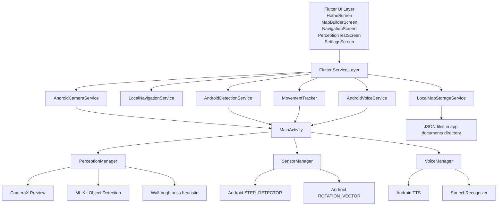

# Architecture

This document describes the architecture that is actually present in the repository. It is intentionally grounded in the code that exists today and does not describe capabilities that are not implemented.

## High-Level View

The system is a Flutter Android app that combines a high-contrast GUI, local map management, lightweight perception, and native Android services.

## Flutter UI Layer

The Flutter UI is centered around a black-and-gold high-contrast design defined in `lib/core/app_theme.dart`:

- `HomeScreen` provides access to navigation, map building, saved maps, settings, and a hidden perception test route.
- `MapBuilderScreen` allows users to save a map by walking and marking points.
- `NavigationScreen` selects a map, chooses a destination, starts tracking, and presents instructional progress.
- `PerceptionTestScreen` displays live camera feed and detected objects/wall states.
- `SettingsScreen` stores and updates thresholds using `SharedPreferences`.

## Service Layer

The Flutter service layer wraps native functionality and exposes it in a more app-friendly form:

- `LocalMapStorageService` reads and writes indoor map JSON files to local application documents storage.
- `LocalNavigationService` computes segment progress from `MapNode` data and speaks instructions using `AndroidVoiceService`.
- `MovementTracker` wraps Android sensor events into a simplified movement model.
- `AndroidCameraService` starts/stops the camera via method channel and exposes a texture ID.
- `AndroidDetectionService` listens to the native detection event stream and parses it into `DetectedObstacle` and `WallState` streams.

## Native Android Layer

`MainActivity.kt` is the main bridge between Dart and Android. It registers the following channels:

- `com.navassist/voice`
- `com.navassist/sensors`
- `com.navassist/detection`
- `com.navassist/camera`
- `com.navassist/permissions`

It initializes:

- `VoiceManager`
- `SensorManager`
- `PerceptionManager`

### Voice Manager

`VoiceManager` uses Android `TextToSpeech` and `SpeechRecognizer` to enable spoken navigation instructions and recognition hooks.

### Sensor Manager

`SensorManager` registers listeners for:

- `Sensor.TYPE_STEP_DETECTOR`
- `Sensor.TYPE_ROTATION_VECTOR`

It emits step events and heading values to Flutter using event channels.

### Perception Manager

`PerceptionManager` initializes CameraX and binds a preview plus an `ImageAnalysis` use case. It then runs ML Kit object detection on each frame and emits detection results over an event channel. It also performs a simple wall brightness heuristic over left/center/right zones.

## Data Model Layer

The map data model is intentionally lightweight:

- `MapNode` stores name, sequence, coordinates, step counts, distance, and turn metadata.
- `MapEdge` stores pairing information between nodes and directional semantics.
- `IndoorMap` wraps a list of nodes and edges and serializes them into JSON.

This is useful for prototype indoor route definition, but it is not a full SLAM or map-optimization dataset.

## Runtime Flow

The main runtime flows are:

1. User opens the app and selects a screen.
2. The app may request camera, microphone, and activity recognition permissions.
3. The camera starts through the native `PerceptionManager`.
4. Object detection and wall analysis emit data to Flutter.
5. Sensor tracking updates step count and heading.
6. Map Builder stores route points to local JSON files.
7. Navigation reads the JSON map and compares motion progress against stored node metadata.
8. Voice service speaks route guidance and alerts.

## Architectural Constraints

The current architecture has a few important constraints:

- It is Android-first and not platform-agnostic.
- It uses native briding rather than a full plugin architecture.
- Motion estimation is approximate and not robust across real-world drift or changing terrain.
- The map format is simple and hand-built rather than generated by a robust spatial model.
- The project is structured for experimentation and proof-of-concept evaluation rather than deployment.

## Conclusion

The repository implements a compact but understandable architecture: Flutter UI + service layer + Android-native sensors and perception. It is suitable as an accessible prototype platform for indoor awareness and route guidance, but it is not a production-ready navigational system.
